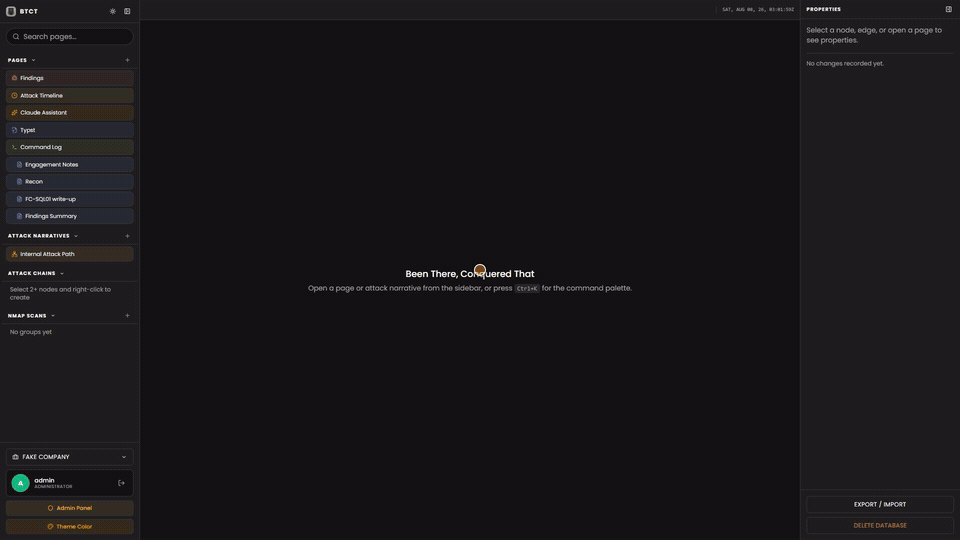

# Been There, Conquered That (BTCT)

A LAN-hosted, multi-user, **real-time collaborative** note-taking and reporting
app for penetration-testing engagements. It combines Notion-style pages, nmap
import, team shell-command capture, shared screenshot assets with crop and
redaction, and Google-Docs-style live co-editing across every machine on the
LAN, all from a single Docker container. It is built to stay comfortable on a small host: 1 to
2 GB of RAM and 1 to 2 cores.



*One continuous take against a small demo workspace. If the GIF looks fuzzy, the
crisp version is [`blog/media/btct-demo.mp4`](blog/media/btct-demo.mp4) at
1920x1080.*

> **New here?** Jump to the [Feature tour](#feature-tour) for what it does, the
> [Keyboard shortcuts](#keyboard-shortcuts--gestures) for how to drive it fast,
> or [Run locally](#run-locally-on-windows-with-docker-desktop) to get it up.
>
> **AI agent / new contributor working on the code?** Start at
> [Architecture & internals](#architecture--internals-for-developers--llms):
> it's written to be your onboarding doc: the mental model, the data model,
> every key file, the non-obvious invariants, and "how to extend X" recipes.

---

## Table of Contents

- [Feature tour](#feature-tour)
  - [Pages & the markdown editor](#pages--the-markdown-editor)
  - [Screenshots: crop, redact, organize](#screenshots-crop-redact-organize)
  - [Nmap import](#nmap-import)
  - [Lightweight operations interface](#lightweight-operations-interface)
  - [Command log (team shell-command capture)](#command-log-team-shell-command-capture)
  - [Real-time collaboration](#real-time-collaboration)
  - [Workspaces, navigation & layout](#workspaces-navigation--layout)
  - [Edit history & versioning](#edit-history--versioning)
  - [Export & import](#export--import)
  - [Accounts, roles & settings](#accounts-roles--settings)
- [Keyboard shortcuts & gestures](#keyboard-shortcuts--gestures)
- [How it works (runtime)](#how-it-works-runtime)
- [Tech stack](#tech-stack)
- [Architecture & internals (for developers & LLMs)](#architecture--internals-for-developers--llms)
  - [The mental model](#the-mental-model)
  - [The two-tier Yjs/CRDT design](#the-two-tier-yjscrdt-design)
  - [Data model](#data-model)
  - [Data layer: database, repos, stores](#data-layer-database-repos-stores)
  - [Editor internals](#editor-internals)
  - [Server & HTTP API reference](#server--http-api-reference)
  - [Key files map](#key-files-map)
  - [Conventions & invariants (read before changing anything)](#conventions--invariants-read-before-changing-anything)
  - [Recipes: how to extend](#recipes-how-to-extend)
- [Repository layout](#repository-layout)
- [Run locally on Windows with Docker Desktop](#run-locally-on-windows-with-docker-desktop)
- [One-click launcher (Windows)](#one-click-launcher-windows)
- [What persists (and what doesn't)](#what-persists-and-what-doesnt)
- [Backups & restore](#backups--restore)
- [Releases & production deploy](#releases--production-deploy)
- [Tests](#tests)
- [Security posture](#security-posture)
- [License](#license)

---

## Feature tour

### Pages & the markdown editor

Pages are Notion-style documents with a title, an editable `/slug` path, tags,
and an optional icon. Right-click a page for **New note inside** (a child page under it), plus rename,
edit path, move to root and delete. They live in a nestable tree (drag a page onto another to
re-parent it; a cycle guard stops you dropping a parent into its own child).

The body is a **live-preview markdown editor** ([Milkdown](https://milkdown.dev)
+ Crepe, Obsidian-style): you type markdown and it renders inline as you go.

- **Block syntax**: `# ` … `###### ` headings, `- ` / `1. ` lists, `- [ ]`
  task lists (click to toggle), `> ` quotes, `|` tables, `---` rules, ``
  images, `[text](url)` links.
- **Slash menu**: type `/` to open the block-insert menu (Heading, lists,
  quote, **Code**, table, image, …); filtering uses Notion's vocabulary, so
  `/bullet`, `/num`, and `/todo` match the bulleted / numbered / to-do list
  entries. Inserting **Code** defaults the new block to the `shell` language.
- **Typing conversions**: the usual markdown (`**bold**`, `*italic*`,
  `~~strike~~`, `` `code` ``, `#`/`##`/`###` headings, `-`/`1.` lists), plus
  two Notion shortcuts: **`[]`** turns into a to-do checkbox the moment you
  type the `]` (no space, `[ ]`/`[x]` + space work too), and **`"` + space**
  starts a quote. Select text and press **`` ` ``** to wrap the selection as
  inline code.
- **Floating format toolbar**: a Notion-style horizontal bar that appears above
  the selection. A **Turn into** dropdown (left) shows the selection's current
  block type and converts it to text / H1–H3 / to-do / bulleted / numbered /
  quote / code, lifting it out of any list or quote first. Then the inline marks
  (bold / italic / strikethrough / inline code) with **live active states**, an
  inline **link** editor, a **7-color highlighter** dropdown (yellow, green,
  blue, pink, orange, purple, red + clear), and a keyboard icon that opens the
  **Keybinds** dialog. *Highlight marks are session-only*: they're an annotation
  aid and are intentionally stripped when the page is saved (CommonMark has no
  highlight syntax), so the saved markdown stays portable.
- **Turn-into shortcuts**: `Ctrl/⌘+Shift+0..8` convert the current block the
  way Notion's digit family does: `0` text, `1`/`2`/`3` headings, `4` to-do,
  `5` bulleted list, `6` numbered list, `8` code.
- **Links**: `Ctrl/⌘+K` (or the toolbar link button) opens Crepe's inline
  "Paste link…" input on the selection instead of a browser prompt; run it on
  an already-linked selection to unlink it.
- **Code blocks**: full syntax highlighting via CodeMirror using the **GitHub
  Dark** palette. Click the language button to pick a language; or press
  **Ctrl+/** (Cmd+/) to jump to the picker, either with the caret inside the block
  or with the block selected. Type to filter, press **Enter** to drop to the
  closest match, then **arrow-key** through the list and Enter to set it (Esc
  closes). New code blocks default to `shell`, whether
  they come from `/code` or from typing ``` and pressing Enter; type a language
  after the fence (```py) to keep it.
- **Terminal palettes**: `shell`/`bash` and `powershell` blocks are highlighted
  like a real terminal, with the command itself coloured (green for shell,
  yellow for PowerShell cmdlets), variables in cyan/blue, strings, keywords and
  comments each in their own colour. Every alias folds in, so ```bash, ```sh,
  ```ps1 and ```pwsh all get the right look; other languages keep GitHub Dark.
- **Resize images**: hover or click an image and drag the handle at its
  bottom-right corner to shrink (or grow) it. Works for both inline images and
  pasted / dropped picture blocks. The size is saved with the note and survives
  reload; other operators see it live.
- **Paste an image = a shared asset you can redact**: paste or drop an image
  into a note and it is uploaded to the same asset store as the report, so it
  shows up in the **Assets Manager**. Right-click it for **Blur / edit image**
  (or select it and press **Ctrl/⌘+Shift+B**) to open the same crop/blur editor
  the report uses, or **Open in Assets Manager**. The blur is non-destructive:
  the original bytes are never overwritten, so opening the image again (in the
  note or the manager) lets you adjust or remove the blur and get the original
  back. The note shows the redacted version live. Delete the image from the note
  and its asset is removed from the Assets Manager too; the image is then kept
  only for the history retention window and pruned after that. Deleting an asset
  from the Assets Manager (an explicit delete) asks for confirmation and removes
  it immediately.
- **Data retention (admin)**: **Admin panel → Data Retention** sets how many
  days page edit-history and removed images are kept before they are permanently
  deleted (off by default, so nothing is auto-deleted until you choose a number).
  The timer is persisted, so an overdue prune runs right after the container
  restarts, even if it was down past the deadline. There is also a **"delete
  edit history in a date range"** button for a one-off purge.
- **Keyboard shortcuts reference**: open **Shortcuts** (Tools sidebar, or the
  command palette) for a grouped cheat-sheet (getting around, text editor,
  blocks, code blocks, images); the editor rows show your current
  bindings.
- **Notion-style block selection**: tap **Esc** to leave text editing and
  select the block the caret is in. Then **↑/↓** to move the selection,
  **Shift+↑/↓** to multi-select, **Ctrl/⌘+Shift+↑/↓** to move the selected
  block(s) up/down, **Ctrl/⌘+D** to duplicate them, **Backspace/Delete** to
  delete them, **Ctrl/⌘+A** to select all, **Enter** to edit the focused block,
  **Esc/click** to exit. While still editing text, **Ctrl/⌘+A** ladders the
  Notion way (select the block's text, then the block, then every block), and
  **Ctrl/⌘+Shift+↑/↓** moves the current block without selecting it first.
  **Copy** (or cut) a selected block and it goes to the clipboard as both rich
  content and markdown, so pasting it into another note, a terminal or a chat
  keeps a code block as a fenced code box rather than dropping the fences.
- **Per-account personalization**: each account can rebind the editor shortcuts
  (Keybinds dialog, which also lists the built-in block shortcuts) and choose a
  **code accent** color that retints code-block keywords. Both follow your
  account (stored server-side) and apply live.
  (Note: there's no `[[wikilink]]` syntax; use standard markdown links.)

### Screenshots: crop, redact, organize

Paste or drop an image into a note and it is **not** embedded as bytes. It is
uploaded as a shared asset and the note keeps a reference, so the same picture
shows up in the **Assets** tab, and anything you do to it there shows up in
every note that uses it.

- **Folder tree**: file assets by engagement phase, host, whatever shape the
  work wants. Drag a card onto a folder (or drop OS files straight onto one),
  drag folders into folders to nest them, and click a folder to browse it with
  a breadcrumb. Folders are organizational only: an asset's path stays
  `/assets/<name>` wherever it sits, so re-filing never breaks a note.
- **Crop as a viewport, not a free rectangle**: the frame keeps the image's own
  proportions and you pan and scale the image behind it, so what is inside the
  frame is exactly what the note renders. **Fill** covers the frame, **Fit**
  puts the whole image inside it, and **Auto-trim** detects a screenshot's
  border and re-frames to the content.
- **Redaction**: switch to blur mode and drag rectangles over anything
  sensitive. A new region starts as **pixelate at 40%**, and each region can
  be switched to gaussian or given its own strength (25% to 300%). Pixelate
  floors its block size at 8px however light the strength, so the lightest
  setting is still past the point mosaic-reversal tooling works; the gaussian
  path downscales before it blurs, because a plain gaussian over readable text
  can sometimes be reversed. Admins set a workspace default strength per style
  and each account can override it.
- **Nothing is destructive.** The crop and the redaction rectangles are
  metadata on the asset record, applied when the bytes are read. The upload is
  never overwritten, so you can reopen an image at any time, adjust a redaction
  or remove it, and get the original back.
- **Live for everyone**: the metadata is in the shared Yjs doc, so a crop or a
  blur reaches every teammate immediately. The bytes live server-side on the
  `/data` volume rather than in the CRDT, because a workspace with thirty
  multi-MB screenshots would otherwise be broadcast to and permanently cached
  by every connected client.
- **Deleting a note image retires it** (soft delete) rather than removing the
  bytes, so page history keeps rendering it until the retention window prunes
  it. The Assets tab's own delete button is a hard delete and asks first.

### Nmap import

Create a scan group in the sidebar, then drag-drop (or pick) one or more nmap
**XML** files. The parser extracts host IP, hostname, OS (osmatch/osclass with a
port-signature fallback), and per-port service/version/script output, skipping
hosts that are down. Re-importing the same IP merges ports. Each machine has an
editable, collaboratively-synced hostname and an OS dropdown, and opens in its
own tab with its open, closed and filtered ports plus NSE script output.

### Command log (team shell-command capture)

A running record of the commands the team actually executed on their own boxes,
so the report's evidence trail writes itself instead of being reconstructed from
memory. Open it from the sidebar (**Command Log**) or the command palette.

- **How it's fed.** Each operator runs a small standalone Python agent
  (`cmdlog-agent/`) on their Kali box. A shell hook (bash/zsh) captures each
  whitelisted command as it's typed and the agent ships it to BTCT with the
  operator name, hostname, working directory, start time, **exit code, and
  duration**. A long scan appears the moment it starts and its result fills in
  when it finishes. Nothing changes about how operators type commands.
- **Whitelist-driven.** Only tools on the whitelist are logged (nmap, gobuster,
  hydra, sqlmap, crackmapexec, impacket, …); everything else you type is ignored
  and never leaves the box. Admins edit the whitelist in **Admin → Command Log**,
  and every agent picks up the change within ~60s.
- **Secrets are redacted** before they leave the operator's box: passwords, hashes,
  auth headers, and URL credentials become `«REDACTED»`; the unredacted line stays
  in a local log on that box. Redaction is tool-aware (`nmap -p 1-65535` keeps its
  ports; `mysql -pSECRET` is scrubbed).
- **Live + filterable.** The viewer filters by operator, tool, host, status
  (running / success / failed), time window, and free-text command search, and
  **exports the filtered set as CSV or JSON** for the report. New commands push in
  live with no reload.
- **Manual entries.** Not everything is captured by the agent: an **Add entry**
  button lets you hand-enter a command as any operator (command, tool, host, cwd,
  start time, exit code, duration). Manual entries go through the same durable
  path (SQLite + CRDT) and are never redacted.
- **Setup.** Turn it on in **Admin → Command Log** (mints a shared ingest token),
  then on each box: `python3 -m btct_agent install --server http://<host>:8080
  --token <token> --operator <you>` and `python3 -m btct_agent run`. See
  [`cmdlog-agent/README.md`](cmdlog-agent/README.md).

Storage is split on purpose: the server keeps a **durable SQLite archive** of every
command (unbounded, queried over REST with filters) and mirrors only the most recent
~500 per workspace into the shared CRDT for the live view, so the collaborative doc
stays bounded while no history is ever lost.

### Lightweight operations interface
The Operations interface uses solid neutral-grey panels, compact tables, crisp borders and system fonts. Every surface token is zero-saturation, so the only hues on screen are the status colours (red, amber, green, purple), the code-syntax themes and whatever accent an account picks for itself. It replaces the translucent Glass skin and removes continuous decorative glow, animated backgrounds and backdrop blur. Dark/light mode, custom accent colours and editor colours remain available.

The workspace overview shows real page, scan and asset counts, recently updated pages, and direct links to the report, the command log and a scan group. Heavy editors, exports, image tools and account panels load when opened. History polling and the minute clock pause while the browser tab is hidden. Icons share a single bundle to reduce startup requests.

Closed pages save to the offline cache before releasing their memory and live connection. Open page and history tabs stay connected, including background tabs. Reopening a closed page restores its saved content and reconnects; offline changes reach the server when the page reconnects. If the browser cannot save a page, the app retains it in memory. Exports wait for document state before encoding it.

Six features have been removed outright: web recon, the attack-narrative graph canvas, the Findings Collector, the Attack Timeline, attack chains, and the in-app Claude assistant (with the hosted MCP server that shared its tools). There is no UI, route, repo, store slice or subscription left for any of them, and the client no longer ships `@xyflow/react`, `@dagrejs/dagre`, `html-to-image` or `date-fns`, nor the server `@anthropic-ai/sdk`, `@modelcontextprotocol/sdk` or `zod`.

Existing records are kept, not deleted. Workspaces that had graphs, findings, chains, timeline events or site maps still hold them in the shared document, and they still round-trip through workspace ZIP files and full server backups as archived data (see [Export & import](#export--import)).

Generated `dist/` bundles are ignored by Git. Run `bun run build` for a local production client; Docker builds the client directly from source. This avoids carrying obsolete recon code and unused generated assets in the branch.

Measurements, verification and preview commands: [Lightweight redesign record](docs/lightweight-redesign-2026-09-06.md).

### Real-time collaboration

Everything is live and multi-user over the LAN:

- **Character-by-character merge** on every text field (page title/slug,
  workspace and scan names, nmap hostnames). Two people typing in the same
  field never clobber each other (Yjs `Y.Text` CRDTs).
- **Live page co-editing** with remote carets and name tags (Google-Docs style),
  backed by a per-page CRDT document and Milkdown's collab plugin.
- **Presence & follow**: each user broadcasts `{ id, name, color }` plus their
  current view. Press **`Mod+Shift+U`** (or the command palette → *Active Users /
  Follow*) to open the active-users window and **follow** a teammate: your view
  live-mirrors theirs, scrolling to their text caret or opening the nmap host
  they're inspecting. If you have split panes
  the first follow asks whether to drop the view into a pane or take over; per-
  teammate **precision** (jump to their exact spot vs. just open their view) is set
  in **Profile → Following**. Press **Stop** or navigate away to detach.
- **Offline-first**: IndexedDB caches every doc so the UI renders instantly and
  reconciles when the connection returns.

### Workspaces, navigation & layout

- **Workspaces**: create/switch/delete from the sidebar footer; the active
  workspace is remembered across reloads. All pages, scans and assets are
  scoped to it.
- **Tabs**: open pages, nmap groups/machines, the command log, the assets
  manager and the shortcuts sheet as tabs. Cycle with **←/→**, close
  with **Alt+W**, and the **browser back/forward** buttons walk your tab history.
  **Drag a tab left or right** along its strip to reorder it (a bar shows where
  it lands; dropping on the empty end of the strip moves it last). The
  Properties panel's **Open version history** button turns into **Close
  version history** while that page's History tab is open, and the tab has its
  own close button in its header.
- **Split panes**: drag a tab to a pane edge (left/right/top/bottom) to split;
  drag the divider to resize; emptying a pane collapses the split automatically.
- **Command palette**: **Ctrl/⌘+K** to create a page, open a tool, toggle dark
  mode, or jump to any page by name. (If text is selected in the editor,
  Ctrl/⌘+K instead inserts a link.)
- **Search**: the sidebar search box does live title/tag search over pages.
- **Sidebars**: left = navigation tree (Tools, Pages, Nmap Scans); right =
  context properties ("last edited by" badge, change log, page versions,
  export/import).

### Edit history & versioning

Two complementary systems. See [Edit history & rollback](#edit-history--versioning-detail)
below for the full mechanics:

- **Activity log**: every create/update/delete/restore on a workspace or page,
  with author + timestamp + a reversible
  field delta (or a full entity snapshot for deletes). Surfaced as the
  right-sidebar **History** feed and as per-entity "Last edited by …" badges;
  reversible entries get an **Undo** button.
- **Page version history (Google Docs style)**: the server keeps a version
  timeline per page. Versions are recorded automatically about two minutes
  after editing stops (and every ten minutes during a long session, and when
  the last editor leaves), on demand as **named** versions from the Properties
  panel or the History tab, and after every restore. Nothing is thinned; a
  named version is deleted by its author or an admin, an automatic one by an
  admin. **Open version history** opens a tab with the rendered version on the
  left and a day-grouped timeline on the right; **Show changes** colours every
  insertion and deletion since the previous version in the colour of the
  account that made it, and the timeline filters by person or by named
  versions only. **Restore this version** rewrites the live page as a normal
  edit (everyone sees it, later versions are kept) and records a "Restored …"
  version. Versions written by older builds appear as *imported* (restorable,
  without per-user colours).

### Export & import

- **Markdown**: per page (single `.md` or a `.zip`).
- **Lossless workspace ZIP**: the full workspace (every entity as JSON, plus
  per-page raw CRDT state and human-readable `.md` companions), with
  *import-as-new* (re-IDed) or *replace-existing* modes. The ZIP also carries
  the tables behind removed features (graphs, nodes, edges, attack chains,
  timeline events, site maps) under the same filenames older builds used, so
  an archive stays complete and re-imports into either build.

### Accounts, roles & settings

- **Auth**: username/password login (no self-signup; admins create accounts). A
  bootstrap `admin` account is created on first launch.
- **Admin panel** (admins only): create/delete users, reset passwords, toggle
  admin (the server blocks deleting yourself or the last admin), configure the
  **Command log** ingest (enable, agent token, tool whitelist, target
  workspace), the **Blur defaults** and **Data retention**, and **Backups** (consistent scheduled snapshots to a host folder; see
  [Backups & restore](#backups--restore)).
- **Profile**: your presence **color**, your per-account **code accent**, and
  your **note heading colours** (one colour for every level, or per-level
  overrides; "Auto" inherits the body text). Changes preview live in open
  editors. **Export / Import** turns your settings into a JSON file
  (`btct-prefs-<username>.json`) you can keep and re-apply on another machine;
  an imported file is validated field by field and only applied when you Save.
- **Theme** (admins only): the workspace-wide accent color, the **default
  heading colours** for every account, and a **hardlock** that forces those
  heading colours on everyone (users' own choices are kept but ignored until
  unlocked). Saved server-side and pushed to every connected client live. Plus
  a per-client **dark/light** toggle.
- **Interface**: Operations, with solid neutral-grey surfaces, compact navigation, restrained status colours and no continuous decorative effects. Both dark and light palettes are supported. See [Interface themes](#interface-themes).

## Keyboard shortcuts & gestures

"Mod" = **Ctrl** on Windows/Linux, **⌘** on macOS. Editor shortcuts marked ⚙ are
rebindable per account via the Keybinds dialog (gear icon in the floating format
panel).

| Context | Shortcut / gesture | Action |
| --- | --- | --- |
| Global | `Mod+K` | Command palette (or insert link if text is selected) |
| Global | `Mod+Shift+U` | Open the **active-users / follow** window |
| Global | `←` / `→` | Cycle tabs in the active pane |
| Global | `Alt+W` | Close active tab |
| Global | Browser back/forward | Navigate tab history |
| Editor | `Mod+B` ⚙ / `Mod+I` ⚙ / `Mod+Shift+X` ⚙ | Bold / Italic / Strikethrough |
| Editor | `Mod+E` ⚙ | Inline code |
| Editor | `Mod+K` / `Mod+Shift+K` ⚙ | Inline link editor (unlink if already a link) |
| Editor | `Mod+Shift+H` ⚙ | Highlight (re-applies the last color used) |
| Editor | `Mod+Shift+0..8` | Turn block into text / H1–H3 / to-do / lists / code |
| Editor | `` ` `` around a selection | Wrap selection as inline code |
| Editor | `[]` · `"` + space | To-do checkbox · quote block |
| Editor | `/` | Slash block-insert menu (`/bullet`, `/num`, `/todo`, …) |
| Editor | ``````````` + `Enter` | Code block (Shell unless a language follows the fence) |
| Editor | `Esc` | Select the current block (enter block mode) |
| Editor / Block mode | `Mod+A` | Ladder: block text → the block → all blocks |
| Editor / Block mode | `Mod+Shift+↑`/`↓` | Move the current / selected block up / down |
| Block mode | `↑`/`↓`, `Shift+↑`/`↓` | Move / extend the block selection |
| Block mode | `Mod+D`, `Backspace`/`Delete`, `Enter`, `Esc`/click | Duplicate / delete / edit / exit |
| Code block / Block mode | `Mod+/` ⚙ | Focus the language picker (works with the block selected too) |
| Language picker | type, `Enter`, `↑`/`↓`, `Esc` | Filter, Enter drops to the closest match, arrows choose, Enter sets, Esc closes |
| Image editor | `Enter` / `Esc` | Save the crop and redactions / cancel |
| Nmap | `Ctrl+Shift+click` a machine card | Open machine in a new tab |

---

## How it works (runtime)

BTCT is two cooperating processes packaged into one Docker image:

1. **Bun HTTP/WebSocket server** (`server/`)
   - REST API for auth (`/api/login`, `/api/me`, `/api/me/profile`, admin routes,
     `/api/settings`); see the [API reference](#server--http-api-reference).
   - Serves the built Vite client (`STATIC_DIR=/app/dist`) on the same port, with
     SPA fallback to `index.html`.
   - Hosts a Yjs WebSocket endpoint at `/yjs/<roomname>?token=<jwt>` that proxies
     clients into shared CRDT documents via `y-websocket/bin/utils.setupWSConnection`.
     The JWT is verified once at the WS upgrade.
   - Stores users + settings in `bun:sqlite` at `/data/data.sqlite`. Passwords are
     PBKDF2‑SHA256 (200 000 iterations); session tokens are HMAC‑SHA256 (7-day TTL).
   - Persists all Yjs rooms to `/data/yjs/` via LevelDB (`YPERSISTENCE`).

2. **Vite/React client** (`src/`)
   - Authenticates against `/api/login`, then opens WebSockets to `/yjs/...`.
   - Holds **one shared Yjs doc** (room `btct-shared`) with all workspaces, pages,
     change logs, page snapshots, nmap scans + machines, assets and the live
     command-log window. Every collaboratively-edited text field is a `Y.Text`
     keyed `<entity>:<id>:<field>`.
   - Holds **one Y.Doc per page** (room = the page id) for the markdown body,
     cached in IndexedDB.
   - Awareness pushes `{ id, name, color }`, rendered as carets + a presence row.

When a user drags a node, edits a page, or imports nmap XML, the change is written
to the appropriate Yjs structure → broadcast over the WS → every peer's Zustand
store re-derives its UI from the merged doc state. Auth/admin/settings go through
normal REST.

---

## Tech stack

### Client
- **Vite 8** + **React 19** + **TypeScript (strict)**
- **Milkdown 7 (Crepe)** + `@milkdown/plugin-collab` + **CodeMirror 6** code blocks
  (`@codemirror/language-data`, GitHub-Dark token theme)
- **Yjs 13** + **y-websocket 2** + **y-prosemirror 1** + **y-indexeddb 9**
- **Zustand 5** for app/auth/theme state
- **Tailwind CSS 4** + **Radix UI** primitives + **lucide-react** icons
- **cmdk** command palette, **JSZip** export bundles
- **Vitest 4** unit tests

### Server (`server/`)
- **Bun 1.3** runtime (`bun:sqlite`)
- Plain `node:http` + `ws.WebSocketServer`
- `y-websocket/bin/utils.setupWSConnection` for every Yjs room
- **`y-leveldb`** for durable Yjs persistence (via `YPERSISTENCE`)
- PBKDF2-SHA256 password hashing, HMAC-SHA256 signed bearer tokens

### Packaging / deployment
- **Docker** + **docker compose** (multi-stage `Dockerfile`)
- Single image serves API + WebSocket + static client on one port
- Persistent SQLite + Yjs LevelDB on the `btct-data` volume at `/data`
- PowerShell automation: `Start-BTCT.ps1`, `Install-BTCTShortcut.ps1`,
  `Backup-BTCT.ps1`, `Restore-BTCT.ps1`, `Publish-BTCT.ps1`

---

## Architecture & internals (for developers & LLMs)

> This section is the orientation guide for anyone (human or AI) changing the
> code. Read [Conventions & invariants](#conventions--invariants-read-before-changing-anything)
> before you touch the data layer. Several non-obvious rules keep collaboration
> from corrupting.

### The mental model

There is **no application database in the traditional sense.** The "database" is
a set of **Yjs CRDT documents** synced over WebSockets and cached in IndexedDB.
The flow for any data change is always:

```
UI event → repo/store action → write to a Y.Map / Y.Text  (inside doc.transact)
        → y-websocket broadcasts to the server + peers
        → each client's Y observer fires
        → shared-bindings re-derives Zustand state (debounced)
        → React re-renders
```

The Bun server is intentionally thin: it does **auth + static hosting + a Yjs
relay with on-disk persistence**. Beyond page version history, command-log
ingest and asset retention it does *not* understand what the data means. It
lives inside the CRDT documents the clients share.

### The two-tier Yjs/CRDT design

| | Shared doc | Per-page doc |
| --- | --- | --- |
| Room name | `btct-shared` | the page's `id` |
| Holds | all entity records + every collaborative text field | one page body |
| Structure | one `Y.Map` per table + one `texts` `Y.Map` of `Y.Text`s | a `prosemirror` `Y.XmlFragment` |
| Edited by | repos / stores | Milkdown collab plugin |
| Cache | IndexedDB `btct-btct-shared` | IndexedDB `btct-page-<id>` |
| Files | `src/realtime/shared-doc.ts` | `src/realtime/yjs-providers.ts` |

- **Records** are plain JSON in a per-table `Y.Map` keyed by `id`
  (last-writer-wins). Tables: `workspaces`, `pages`, `changeLogs`,
  `pageSnapshots`, `nmapScans`, `nmapMachines`, `typstAssets`, `assetFolders`,
  `commandLogs`. The maps behind removed features (`graphs`, `graphNodes`,
  `graphEdges`, `attackChains`, `timelineEvents`, `siteMaps*`) still exist in
  older documents but are not in `TABLE_NAMES`: only
  [src/export/retired.ts](src/export/retired.ts) reads them, for archiving.
- **Collaborative text fields** are `Y.Text`s in the single `texts` map, keyed
  `<entity>:<id>:<field>` (e.g. `page:<id>:title`). A `mirrorTextsToRecords`
  observer writes each `Y.Text`'s value back into the JSON record's field, so the
  rest of the app (sidebar, search, exports) can read plain JSON. The
  collaborative fields are: page `title`/`slug`, workspace `name`, nmap scan
  `name`, nmap machine `hostname`.
- **Page bodies** never go in the shared doc. They live in the per-page doc and
  are checkpointed via [page snapshots](#edit-history--versioning-detail).

### Data model

All types live in [src/types/index.ts](src/types/index.ts). IDs are UUIDv4.
Fields shown as *(Y.Text)* are collaborative; everything else is last-writer-wins.

| Entity | Key fields |
| --- | --- |
| **Workspace** | `id`, `name` *(Y.Text)*, `description`, timestamps |
| **Page** | `id`, `workspaceId`, `parentId`, `title` *(Y.Text)*, `slug` *(Y.Text)*, `icon`, `tags[]`, `content` (markdown), `sortOrder`, `isGraphPage` (legacy, always false for new pages), timestamps |
| **NmapScan** | `id`, `workspaceId`, `name` *(Y.Text)*, `importedAt`, `rawXml?` |
| **NmapMachine** | `id`, `scanId`, `ip`, `hostname` *(Y.Text)*, `os` (windows\|linux\|attacker\|unknown), `ports[]`, `linkedNodeId?` (legacy), timestamps |
| **ChangeLogEntry** | `id`, `workspaceId`, `action`, `target`, `targetId`, `summary`, `timestamp`, author (`userId`/`userName`/`userColor`), `field?`, `prevValue?`, `newValue?`, `reversible` |
| **PageSnapshot** | `id`, `pageId`, `workspaceId`, `timestamp`, author, `label?`, `updateBase64` (`Y.encodeStateAsUpdate`), `byteLength` |
| **TypstAsset** (an image asset; the type and its `typstAssets` table keep their names so existing documents still parse) | `id` (= server blob id), `workspaceId`, `kind` (`image`; `font` exists only in old records), `filename` (also its `/assets/<name>` path), `mime`, `size`, `width?`/`height?`, `crop?` (`CropRect`, normalized 0..1; `null` = full image), `blurs?` (`BlurRegion[]`, normalized redaction rectangles; `null` = none), `fontFamily?`, timestamps. **Metadata only; the bytes live server-side.** |
| **CommandLogEntry** | `id` (agent-generated, the idempotency key), `workspaceId`, `operator`, `command` (redacted), `tool`, `cwd?`, `host?`, `localUser?`, `shellPid?`, `startedAt`, `receivedAt`, `exitCode?` (`null` = still running), `durationMs?`, `redacted?`. **No Y.Text fields**, all LWW JSON. Written **only by the server ingest endpoint**; the shared-doc copy is a bounded live window over the SQLite archive. |

### Data layer: database, repos, stores

- **[src/db/database.ts](src/db/database.ts)**: a Dexie-*shaped* API
  (`get`/`add`/`put`/`update`/`delete`/`where().equals()`) backed by the shared
  Y.Maps instead of IndexedDB tables. Every write is wrapped in a Yjs transaction.
- **`src/db/*-repo.ts`**: one repo per entity (`pageRepo`, `workspaceRepo`,
  `changelogRepo`, `pageSnapshotRepo`, `nmapScanRepo`/`nmapMachineRepo`,
  `typstAssetRepo`, `assetFolderRepo`, `commandLogRepo`). Repos do CRUD +
  queries, **pre-seed `Y.Text`s on create**, and cascade deletes (deleting a
  scan removes its machines; deleting a workspace removes its pages).
- **[src/stores/app-store.ts](src/stores/app-store.ts)**: the Zustand store:
  workspaces, pages, tabs, pane layout, search, change log, nmap, assets,
  command log. Mutating actions call the repos **and** the `log()` helper to
  write a change-log entry.
- **[src/stores/shared-bindings.ts](src/stores/shared-bindings.ts)**:
  `bindSharedSubscriptions()` wires each table's `Y.Map.observe` to a debounced
  store reload (`queueMicrotask`), so a burst of CRDT changes coalesces into one
  re-render.
- **[src/realtime/use-y-text.ts](src/realtime/use-y-text.ts)**:
  `useYTextInput(key, initial)` binds an `<input>` to a `Y.Text` with diff-based
  deltas and caret-preservation on remote edits.

### Editor internals

The page editor ([src/components/editor/PageEditor.tsx](src/components/editor/PageEditor.tsx))
mounts one Crepe instance per page, with the Toolbar feature disabled and these
custom plugins layered on:

- [src/lib/highlight-plugin.ts](src/lib/highlight-plugin.ts): the 7-color
  `highlight` mark + `ToggleHighlight` command. **Session-only**: its
  `parseMarkdown` is a no-op and `toMarkdown` drops the mark (keeps the text).
- [src/lib/code-theme.ts](src/lib/code-theme.ts): CodeMirror language list +
  a class-based `HighlightStyle` (`Prec.highest`) whose colors come from
  `--code-*` CSS vars; `applyCodeAccent(hex)` live-retints `--code-keyword`.
- [src/lib/theme.ts](src/lib/theme.ts): the accent (`applyThemeColor` writes
  `--primary`/`--ring`) and note heading colours (`applyHeadingColors` writes
  `--heading-color` and `--heading-1..6`). `resolveEffectiveHeadings` is the
  precedence rule: admin hardlock → the user's own prefs (as a whole, once
  customised) → admin defaults → inherit. Pure; tested in
  `src/test/theme-prefs.test.ts`. `src/stores/theme-store.ts` holds the admin
  policy, seeded by `GET /api/settings` and then followed live through the
  server-written `settingsPublic.theme` map, plus the workspace blur-strength
  defaults (`settingsPublic.blur`), resolved per account by
  `resolveBlurStrengthPolicy` in [src/lib/editor-prefs.ts](src/lib/editor-prefs.ts).
- [src/themes/registry.ts](src/themes/registry.ts) + [src/themes/operations.css](src/themes/operations.css):
  the Operations look (see [Interface themes](#interface-themes)).
- [src/lib/editor-keybinds.ts](src/lib/editor-keybinds.ts):
  `codeBlockShellDefault` (schema default language = shell), `codeFenceInputRule`
  (replaces commonmark's ``` rule, which stores the captured language verbatim
  and so bypassed that default for a bare fence; `PageEditor` `remove()`s the
  preset's rule because input rules are first-match-wins), `userKeybindsPlugin`
  (runs *before* commonmark's keymap so rebinds win; also implements
  backtick-wrap, and mirrors the language-picker shortcut so it also opens when a
  code block is selected), and `focusLanguageKeymap` (the caret-in-block path) +
  `installLanguagePickerNav()` (`closestMatchIndex` picks the Enter target) for the
  language picker.
- [src/lib/editor-prefs.ts](src/lib/editor-prefs.ts): `EditorPrefs` shape,
  defaults, and the `parseShortcut`/`matchShortcut`/`shortcutFromEvent` helpers.
- [src/lib/block-select.ts](src/lib/block-select.ts): the Notion-style block
  selection plugin (its own selection state + node decorations).
- [src/lib/active-editor.ts](src/lib/active-editor.ts): module-level handle to
  the focused editor so `App.tsx` can hijack `Mod+K` for link insertion.

Live settings (keybinds, code accent) are applied through **module-level refs**
updated by an effect in `App.tsx`, never by rebuilding the editor, which would
tear down the Yjs collab binding.

### Interface themes
BTCT ships the Operations look, declared in [src/themes/registry.ts](src/themes/registry.ts). [src/themes/operations.css](src/themes/operations.css) styles the shell and editor using native CSS over the shared base styles. The attribute `data-ui-theme="operations"` is set in `index.html` before first paint and reinforced by `main.tsx`.

Surfaces are opaque neutral grey (no blue or slate tint anywhere in the chrome) and typography uses installed system fonts. Selection and focus use borders and colour rather than motion. The stylesheet does not reset report transforms. Reduced-motion preferences also suppress progress animations and transitions. Custom workspace accents and per-user note/code colours remain CSS-variable updates and never rebuild the editor.

### Server & HTTP API reference

Base URL defaults to the same origin. Bearer token from `/api/login`
(`Authorization: Bearer <jwt>`, 7-day TTL). Implemented in
[server/index.mjs](server/index.mjs); auth crypto in
[server/auth.mjs](server/auth.mjs); SQLite in [server/db.mjs](server/db.mjs).

| Method | Path | Auth | Purpose |
| --- | --- | --- | --- |
| `GET` | `/healthz` | none | Liveness probe (`{ ok: true }`) |
| `GET` | `/api/settings` | none | Public theme + blur defaults: `themeColor`, `themeHeadings`, `themeLock`, `themeUpdatedAt`, `blurDefaults`, `blurUpdatedAt` (so login paints correctly) |
| `POST` | `/api/settings/theme` | admin | Set any of `color`, `headings`, `lock`; the result is mirrored into the shared doc (`settingsPublic.theme`) |
| `POST` | `/api/settings/blur` | admin | Set the workspace default blur strengths (`gaussian`, `pixelate`, each 0.25..3); mirrored into `settingsPublic.blur` |
| `POST` | `/api/login` | none | Authenticate → `{ token, user }` |
| `GET` | `/api/me` | yes | Current user |
| `POST` | `/api/me/profile` | yes | Update own `color` and/or `prefs` (`codeAccent`, `keybinds`, `follow`, `theme`, `blurDefaults`; a legacy `uiTheme` slug is accepted and ignored) |
| `GET` | `/api/admin/users` | admin | List users |
| `POST` | `/api/admin/users` | admin | Create user (username 3–32, password ≥8) |
| `DELETE` | `/api/admin/users/:id` | admin | Delete user (not self / not last admin) |
| `POST` | `/api/admin/users/:id/password` | admin | Reset a user's password |
| `POST` | `/api/assets?workspaceId&kind&filename` | yes | Upload one image asset. Body is **raw bytes** (not multipart/JSON). `kind` = `image`\|`font` (`font` is legacy); max 25 MB; extension must be allowed. An image's extension is corrected to match its actual magic number → `{ asset }` |
| `GET` | `/api/assets?workspaceId=…` | yes | Metadata inventory of a workspace's assets |
| `GET` | `/api/assets/:id` | yes | The raw asset bytes (`Cache-Control: immutable`, since bytes never change for an id) |
| `DELETE` | `/api/assets/:id` | uploader/admin | Delete the row **and** the file on disk |
| `GET` | `/api/pages/:id/versions` | yes | Version timeline of a page, newest first: `{ versions, users, tracked, dirty, twinExists }`. Imports the page's legacy `pageSnapshots` rows on first read |
| `POST` | `/api/pages/:id/versions` | yes | Record a version of the open page now (`{ name?, trigger: 'named' \| 'restore' }`); 409 when the page room is not open on the server |
| `GET` | `/api/pages/:id/versions/:vid` | yes | One version with its twin `snapshot` and full `state` (both base64; the state is derived from the twin when the row has none) |
| `POST` | `/api/pages/:id/versions/:vid/name` | yes (author/admin to rename a named one) | Name or rename a version (`{ name }`, empty clears) |
| `DELETE` | `/api/pages/:id/versions/:vid` | author (named) / admin | Delete one version |
| `GET` | `/api/pages/:id/history/twin` | yes | The page's GC-off history twin as one Yjs update (`application/octet-stream`, gzipped when accepted) |
| `POST` | `/api/cmdlog/events` | ingest token | Batch ingest from a capture agent (`{ workspace?, events[] }`); upserts by id into SQLite + the CRDT live window |
| `GET` | `/api/cmdlog/whitelist` | ingest token | Tool whitelist the agent fetches + refreshes |
| `GET` | `/api/cmdlog/query` | yes | Filtered read of the durable archive (`workspaceId, operator, tool, host, from, to, q, status, limit`) |
| `POST` | `/api/cmdlog/manual` | yes | Hand-enter one command-log record (as any operator); writes to SQLite + the CRDT live window, never redacted |
| `GET` | `/api/cmdlog/config` | admin | Command-log config incl. token, whitelist, default workspace |
| `POST` | `/api/cmdlog/config` | admin | Enable/disable, set whitelist + default workspace (mints a token on first enable) |
| `POST` | `/api/cmdlog/token` | admin | Regenerate (rotate) the ingest token |
| `DELETE` | `/api/cmdlog/logs?workspaceId=…` | admin | Purge a workspace's command-log archive |
| `GET` | `/api/backup/config` | admin | Backup settings: `enabled`, `fullIntervalMin`, `includes`, folder, host token |
| `POST` | `/api/backup/config` | admin | Update any of `enabled`, `fullIntervalMin`, `includes` |
| `POST` | `/api/backup/token` | admin | Regenerate the host-scheduler token |
| `GET` | `/api/backup/status` | admin or backup token | Last/next run, last error, folder writability, disk usage |
| `POST` | `/api/backup/run` | admin or backup token | Run a backup now (409 while one is already running) |
| `GET` | `/api/backup/list` | admin | Inventory of backup folders |
| `DELETE` | `/api/backup/archives/:name` | admin | Delete one backup folder |
| WS | `/yjs/<room>?token=<jwt>` | yes (at upgrade) | Yjs CRDT relay; rooms = `btct-shared` + one per page id |

The `users` table is `(id, username [NOCASE unique], salt, hash, iter, color,
avatar, is_admin, prefs [JSON], created_at)`. The `prefs` column is added by an
idempotent migration. Per-account editor prefs (`codeAccent`, `keybinds`,
`follow`, `theme`) are validated at the REST edge and stored as a JSON blob.
The `settings` table is a simple key/value store: the theme policy
(`theme_color`, `theme_headings`, `theme_lock`, `theme_updated_at`), the
blur-strength defaults, the command-log ingest config (`cmdlog_enabled`,
`cmdlog_token`, `cmdlog_whitelist`, `cmdlog_workspace`), the backup schedule
(`backup_*`) and the retention window (`retention_days`,
`retention_last_run`). The
`assets` table (`id, workspace_id, kind, filename, mime, size, uploaded_by,
created_at`) is the server's inventory of the image blobs it stores; the bytes
live as files under `ASSETS_DIR` named by the row's uuid. This is the **only**
place the server holds workspace content on disk, and it stays deliberately
dumb about meaning. The crop rectangle and display name are CRDT records, not
columns here. See [server/assets.mjs](server/assets.mjs). The `command_logs`
table (`id, workspace_id, operator, command, tool, cwd, host, local_user,
shell_pid, started_at, received_at, exit_code, duration_ms, redacted`) is the
**durable, unbounded archive** of every command captured by the cmdlog agents;
rows are upserted by the agent-generated `id` (so a start event and its later
exit/duration completion merge, and a replayed batch is a no-op), and the shared
Yjs doc mirrors only the most recent ~500 per workspace for the live view. Ingest
uses a static bearer token (`cmdlog_enabled`/`cmdlog_token`/`cmdlog_whitelist`/
`cmdlog_workspace` in `settings`, token admin-readable). See
[server/cmdlog.mjs](server/cmdlog.mjs).

**Environment variables:** `AUTH_SECRET` (required in prod; HMAC key, random &
ephemeral if unset, which silently invalidates tokens on restart), `HOST`,
`PORT`, `STATIC_DIR`, `DB_PATH`, `ASSETS_DIR` (image blobs; defaults
to `assets/` beside `DB_PATH`, i.e. `/data/assets` in Docker), `HISTORY_DIR`
(per-page GC-off history twins behind version diffs; defaults to `history/`
beside `DB_PATH`, i.e. `/data/history` in Docker), `YPERSISTENCE`
(LevelDB dir; **set it or Yjs rooms are memory-only**), `BACKUP_DIR` (where
scheduled backups are written; `/backups` in Docker, bind-mounted from
`./backups`, else `backups/` beside `DB_PATH`),
`ALLOWED_ORIGIN` (CORS; unset = same-origin),
`ADMIN_USERNAME`/`ADMIN_PASSWORD` (bootstrap admin, default `admin`/`changeme!`).
Client build-time: `VITE_API_URL`, `VITE_WS_URL` (default same-origin).

### Key files map

```
src/
  App.tsx                     Root: auth gate, global hotkeys (Mod+K, tab nav),
                              browser-history tab nav, applies per-account prefs
  api/client.ts               REST client base
  auth/                       auth-store.ts (Zustand + REST), LoginScreen.tsx
  components/
    editor/PageEditor.tsx     Milkdown/Crepe editor + floating format panel
    editor/KeybindsDialog.tsx Per-account keybind capture UI
    nmap/NmapScanView.tsx     XML import, machine grid + machine detail
    cmdlog/CommandLogView.tsx Team command archive (REST seed, then CRDT follow)
    history/HistoryView.tsx   Read-only page-version viewer with per-user diffs
    help/ShortcutsView.tsx    Grouped shortcut cheat sheet (reads live keybinds)
    assets/                   AssetsManager (the tab), AssetsPanel (folder tree
                              + drop zone + grid), ImageEditorDialog (crop and
                              redact), FigureViewport (the framing surface)
    sidebar/                  LeftSidebar (tree/nav), RightSidebar (properties),
                              AdminPanel, ProfileEditor, ThemePicker,
                              ChangeLogPanel, PageHistoryPanel, LastEditedBadge
    ui/                       TabBar, SplitContainer (panes), WorkspaceOverview,
                              CommandPalette, WorkspaceSelector, ExportDialog
  db/                         database.ts (Y.Map-backed table API) + *-repo.ts
  export/                     markdown.ts, workspace-zip.ts, retired.ts
                              (archive-only access to removed features' tables)
  lib/                        editor-* + highlight-plugin + code-theme +
                              block-select + active-editor +
                              nmap-parser + pane-layout + theme +
                              assets (upload/fetch/crop/blur/border-detect) +
                              asset-image + asset-folders + crop-math (pure
                              crop geometry) + blur-math (pure blur-region
                              geometry + strength heuristics) + pane-resize
                              (pane width clamping + layout persistence) +
                              image-format (magic-number sniffing) + utils
  realtime/                   shared-doc.ts (shared Y.Doc + Y.Text registry),
                              yjs-providers.ts (per-page docs), page-snapshots.ts,
                              use-y-text.ts, PresenceAvatars.tsx
  stores/                     app-store.ts, shared-bindings.ts, theme-store.ts
  test/                       Vitest suites + fixtures
  types/index.ts              All shared types + default factories
server/
  index.mjs                   HTTP + WS entry, all REST routes, static serving
  auth.mjs                    PBKDF2 hashing + HMAC token sign/verify
  db.mjs                      bun:sqlite users + settings + assets + command_logs + page_versions, migrations
  assets.mjs                  Image blob store (disk + metadata rows)
  history.mjs                 Page version history: GC-off twin per room, auto/named/restore versions, twin + version routes
  history-diff.mjs            Who changed a page body between two snapshots (pure, Yjs injected, unit-tested)
  cmdlog.mjs                  Command-log ingest + config (SQLite archive + CRDT live window)
  scheduler.mjs               Single-timeout job scheduler: no overlap, no drift, persisted last run
  backup-format.mjs           Backup folder layout, manifest build/verify, config normalisation (pure)
  data-export.mjs             Consistent reads: VACUUM INTO, per-room Yjs updates, asset inventory
  backup.mjs                  Backup engine: config, scheduled + manual runs, inventory, host token
  restore.mjs                 Restore CLI (run with the server stopped)
cmdlog-agent/                 Standalone Python 3 shell-capture agent (own README + tests)
  btct_agent/                 matcher, redactor, spool, shipper, daemon, installer, hooks/
```

> Adding a file under `server/` means adding a `COPY server/<file>.mjs` line to
> the [Dockerfile](Dockerfile). Server files are copied individually, so a new
> one is silently missing from the image otherwise.

### Conventions & invariants (read before changing anything)

1. **Pre-seed `Y.Text`s in `create()`.** When a repo creates an entity, it must
   `getOrInitYText(textKey(entity, id, field), initial)` for each collaborative
   field, or two clients can race and orphan a text. To add a new collaborative
   field you must touch *all four* of: `TEXT_FIELDS_BY_ENTITY` and
   `TEXT_FIELD_TO_TABLE` in [shared-doc.ts](src/realtime/shared-doc.ts), the repo
   `create()`, and the UI (`useYTextInput`).
2. **Reads use the JSON record, not the `Y.Text`.** The mirror observer keeps them
   in sync; don't read `texts` directly outside the editor/input layer.
3. **Never rebuild the editor to apply settings.** Keybinds and code accent flow
   through module-level refs + CSS vars precisely so the Yjs collab binding
   survives. Rebuilding mid-session breaks live cursors and can drop edits.
4. **Page bodies aren't in the change log.** Per-keystroke logging would be noise;
   rollback for bodies is via page snapshots instead.
5. **Highlight marks are intentionally not persisted** (no CommonMark syntax).
6. **Deletes cascade and are logged with a full snapshot** so they're restorable.
7. **The server is dumb about domain data.** Don't add page logic to the
   server; it only relays Yjs, serves static files, does auth/settings, and
   stores opaque asset blobs. The deliberate exceptions are
   [history.mjs](server/history.mjs) (per-page twin docs and their versions),
   [assets.mjs](server/assets.mjs), which is only *storage* (it knows a blob's size
   and mime, never what it means), and [cmdlog.mjs](server/cmdlog.mjs), which ingests
   externally-produced command records into SQLite + the CRDT (it validates and
   stores, and knows nothing about what a command means).
   [yjs-data.mjs](server/yjs-data.mjs) is the only door into the shared doc and is
   down to what those need. Server-side CRDT writes must honour the Y.Text rule;
   nothing there writes one today (all LWW JSON, like image assets).
8. **Binary content never goes in the CRDT.** Images and fonts are uploaded to
   the server and referenced from the shared doc by id; only small metadata
   records sync. Base64 blobs in the shared doc get broadcast to *and
   permanently cached by* every connected client. The one exception is page
   snapshots, which are intentionally-bounded Yjs update bytes.
9. **Crops and blurs are render-time transforms, never destructive edits.** A
   `CropRect` and any `BlurRegion[]` are stored on the asset record and applied
   when the bytes are handed to the compiler. Never re-upload transformed
   pixels over the original. It would make the edit irreversible and (for
   crops) degrade the image on each pass. Blur regions are normalized against
   the *original* image, not the crop, so re-framing never moves a redaction;
   the blur itself is downscale-then-gaussian (see
   [blur-math.ts](src/lib/blur-math.ts)) because a plain gaussian of readable
   text can sometimes be reversed.
10. **Image assets have no `Y.Text` fields, deliberately.** Filenames, crop
   rects, and blur regions are last-writer-wins JSON: concurrent
   character-by-character editing of a filename isn't a workflow worth
   supporting, so invariant 1 doesn't apply to `typstAssets`, nor to
   `assetFolders` (the folder tree): folders are organizational only and never
   change an asset's `/assets/<name>` path.
11. **Programmatic Y.Text edits go through `replaceYTextContent`**, which
   splices a minimal delta. Never clear-and-reinsert a Y.Text: it deletes
   every character and re-adds it, destroying collaborators' cursors and
   making the change unmergeable with a concurrent edit.
12. **Drags write to the DOM, not to React state.** A pane resize sets
   `style.width` directly per animation frame and commits to state once on
   pointer-up; a re-render mid-drag would reconcile the whole tab every frame
   and (the real hazard) risk remounting an editor host, dropping the Yjs
   collab binding and every remote cursor with it. The crop window's blur and
   pan gestures follow the same rule for cost: a pointer fires up to 1000
   events a second at a 60 Hz display. And never put a `backdrop-filter` on
   an element a drag resizes, which makes the compositor re-blur everything
   behind it on every sample.
13. **Stored bytes must match the extension they carry.** The decoder is
   chosen from the file extension, so PNG bytes at a `.jpg` path fail.
   `resolveAssetBytes()` encodes crops to the format the *filename* claims
   (not always PNG) and re-encodes uncropped bytes that disagree with their
   extension, so a mislabelled upload self-heals. GIF and SVG are passed
   through untouched; a canvas can't produce them. See
   [image-format.ts](src/lib/image-format.ts).
17. **DB migrations must be idempotent.** Guard every `ALTER TABLE` with a column
   check (see the `prefs`/`avatar`/`is_admin` migration in `db.mjs`).
18. **Set `AUTH_SECRET` and `YPERSISTENCE`** in any real deployment, or tokens and
   rooms evaporate on restart.
19. **Theme precedence lives in one function.** Every heading-colour write goes
   through `resolveEffectiveHeadings` + `applyHeadingColors` from `App.tsx`.
   The admin policy reaches clients by REST seed (`GET /api/settings`) and then
   the server-written `settingsPublic.theme` map in the shared doc, stamped with
   `themeUpdatedAt` so a stale IndexedDB replay never beats a newer value. Never
   put anything secret in `settingsPublic`: the whole doc reaches every user
   (it carries only the theme policy and the blur defaults).
20. **Never copy the live SQLite file or the LevelDB directory.** A WAL-mode
   database copied mid-transaction and an open LevelDB copied mid-compaction
   are both corrupt. Read through `server/data-export.mjs` (`VACUUM INTO`,
   per-room Yjs updates) as the backup engine does, or stop the container first.
21. **Interface skins stay in their own scoped stylesheet.** A theme is a
   registry entry plus one file scoped under `html[data-ui-theme="…"]`; never
   branch component code on the theme. In that file, never give the rails or
   the content column a stacking context (dialogs render inside them with
   `position: fixed`), match class tokens with `[class~=]`, and pair every
   restyled surface with its own `:hover` (unlayered rules beat Tailwind's
   hover utilities too).
22. **No native browser dialogs, and native controls follow the theme.**
   `window.confirm`, `window.prompt` and `window.alert` paint outside the
   skin; use `src/components/ui/ConfirmDialog.tsx` (a portal sheet with an
   optional input) or an inline notice. `index.css` declares `color-scheme`
   on `:root` and `.dark` so select popups, date and colour pickers and
   spinners render in the right scheme, gives `select` its own chevron and
   the range/checkbox/date inputs the accent colour. The audit that
   introduced this is [docs/ui-audit-2026-08-28.md](docs/ui-audit-2026-08-28.md).
23. **Tabs reconcile against the shared doc, and the active pane is always a
   live leaf.** `reconcileTabs()` (app-store) prunes tabs whose page or scan
   no longer exists; it runs after the pages/nmapScans reloads and after
   local deletes, and is a no-op until the shared doc has
   synced. Every layout change goes through `reconcileActive()` so
   `activePaneId`/`activeTabId` never point at a collapsed pane, and
   `moveTab` (pane-layout) removes, adds, then collapses, in that order. When
   you add a way to change the layout, keep both.
24. **Bulk record creation outside the repos seeds its `Y.Text`s.** The demo
   seed and the zip import write records directly, so they call
   `seedMissingYTexts(getSharedDoc())` afterwards; a record without its
   `Y.Text` silently drops inline title edits until a reload. Deleting a
   record through `database.ts` drops its texts (`deleteTextsFor`).
25. **First paint stays small.** Heavy tab views (nmap, command log,
   history, assets) are `React.lazy`
   imports behind one `Suspense` in `SplitContainer`; a new `TabKind` view
   should be too. No external font requests (the skin uses the system
   stack) and no multi-megabyte images in `public/` (the logo ships as
   `new-logo-64.png`, `apple-touch-icon.png` and `new-logo.ico`). The server
   marks only `/assets/*` (hashed) `immutable`; everything else is
   `no-cache` with an ETag. Audit record:
   [docs/perf-bug-audit-2026-08-28.md](docs/perf-bug-audit-2026-08-28.md).
26. **Closed page contexts are released after offline persistence commits.**
   Keep an operation lease during asynchronous page work. Never delete the IndexedDB
   cache when closing a tab; open page/history tabs retain their documents.

### Recipes: how to extend

- **New entity type** → add the type + factory in `types/index.ts`; add a
  `*-repo.ts`; register the table name in `shared-doc.ts`; add a `Table<T>` in
  `database.ts`; add store actions in `app-store.ts`; wire a subscription in
  `shared-bindings.ts`; pre-seed any `Y.Text` fields.
- **New collaborative text field** → see invariant #1.
- **New editor shortcut/action** → add to `KeybindAction` + `DEFAULT_KEYBINDS` +
  `KEYBIND_ACTIONS` in `editor-prefs.ts`; implement in `runAction()` in
  `editor-keybinds.ts`; add a button to the floating toolbar in `PageEditor.tsx`.
- **New "turn into" target / block shortcut** → add to `TurnIntoTarget`,
  `TURN_INTO_ITEMS`, and `digitToTarget` in `lib/turn-into.ts`; the toolbar
  dropdown and the `Ctrl/⌘+Shift+digit` handler both read from there.
- **New HTTP endpoint** → add a branch in `server/index.mjs`, gate with
  `authFromHeader`/`requireAdmin`, parse with `readJsonBody`, reply with
  `sendJson`.
- **New tab kind** → add it to `TabKind` in `types/index.ts`, add a `lazy()`
  render branch in `SplitContainer.tsx`, add icons in `TabBar.tsx` and the pane
  chip, and add it to the `default:` list in `reconcileTabs()` so the tab
  survives a doc sync.
- **New export format** → add `src/export/<fmt>.ts`, export from `export/index.ts`,
  and include it in the workspace ZIP if appropriate.
- **Retiring a feature** → delete its UI, repo, store slice, subscription and
  `TABLE_NAMES` entry, then add its table(s) to `TABLES` in
  `src/export/retired.ts` so the records still archive and re-import. Do not
  delete the maps: a workspace ZIP or a backup may be the only copy left.

---

## Repository layout

```
src/                       Client (see "Key files map" above for detail)
server/
  index.mjs                HTTP + WS entry
  auth.mjs                 PBKDF2 + HMAC token helpers
  db.mjs                   bun:sqlite users + settings + versions + commands
  yjs-data.mjs             The only server-side door into the shared Yjs doc
  history.mjs              Per-page GC-off twin + version timeline
  cmdlog.mjs               Command-log ingest + config
  backup.mjs, restore.mjs  Backup engine + restore CLI (with scheduler, backup-format, data-export)
cmdlog-agent/              Standalone Python 3 command-capture agent (stdlib only)
blog/                      Short illustrated write-up (why it exists + feature tour)
Dockerfile                 Multi-stage build (client → server-deps → runtime)
docker-compose.yml         Single-container deployment
Start-BTCT.ps1             One-click launcher (Docker + browser; popup if running)
Install-BTCTShortcut.ps1   Drops a Desktop shortcut to the launcher
Backup-BTCT.ps1            Tar the btct-data volume to a timestamped .tgz
Restore-BTCT.ps1           Restore a .tgz back into the volume
Publish-BTCT.ps1           Windows release script (auto-bumps patch tag)
```

---

## Run locally on Windows with Docker Desktop

The simplest path: one container, one command, persistent data.

### Prerequisites
- **Docker Desktop for Windows** (WSL2 backend): installed and running
- **Git for Windows**
- **PowerShell 5.1** (bundled) or **PowerShell 7+**

### First-time setup

```powershell
# 1. Clone
git clone https://github.com/<you>/BeenThereConqueredThat.git
cd BeenThereConqueredThat

# 2. Install the Desktop shortcut (also generates .env on first launch).
.\Install-BTCTShortcut.ps1

# 3. Double-click the new "Been There, Conquered That" shortcut on your Desktop.
#    First launch builds the image (a couple of minutes).
```

The default bootstrap admin is **`admin` / `changeme!`**. Change it immediately from
the in-app admin panel. (Override by setting `ADMIN_USERNAME` / `ADMIN_PASSWORD`
in `.env` *before* the very first start.)

### Useful commands

```powershell
docker compose logs -f            # tail server logs
docker compose ps                 # container status
docker compose restart            # restart without rebuild
docker compose down               # stop (data volume preserved)
docker compose down -v            # stop AND wipe the SQLite + Yjs volume
docker compose up -d --build      # apply code changes
```

Inspect the data volume:
```powershell
docker run --rm -it -v beenthereconqueredthat_btct-data:/data alpine ls -la /data
```

### LAN access from teammates
Compose binds `8080` on all interfaces, so any machine on the LAN can hit
`http://<your-windows-ip>:8080`. Allow it through Windows Defender Firewall
(TCP 8080 inbound) the first time someone connects.

**On the Docker host itself, open `http://127.0.0.1:8080`, not `localhost`.**
Browsers and curl resolve `localhost` to `::1` first. With Docker Desktop on
WSL2, Windows' localhost relay (`wslrelay.exe`) listens on `[::1]:8080` as well
as `127.0.0.1:8080`, but only the IPv4 side is forwarded into the Docker VM: the
IPv6 connection is accepted and then never answered, and because the TCP
connect succeeded the browser does not fall back to IPv4, so the page spins
forever. `netstat -ano | findstr :8080` shows the relay owning `[::1]:8080`.
Other machines on the LAN are unaffected (they use the IPv4 address).

### Dev mode (hot reload, without Docker)

```powershell
bun install
bun install --cwd server

# Terminal 1: server
cd server
$env:AUTH_SECRET = -join ((1..64) | ForEach-Object { '{0:x}' -f (Get-Random -Maximum 16) })
$env:ALLOWED_ORIGIN = 'http://127.0.0.1:5173'
$env:YPERSISTENCE = '../data/yjs'   # local dev persistence; safe to delete
bun run start

# Terminal 2: client
bun run dev
```

Then open http://127.0.0.1:5173.

---

## One-click launcher (Windows)

After setup, the app launches via a Desktop shortcut:

```powershell
.\Install-BTCTShortcut.ps1
```

Double-clicking the shortcut runs [`Start-BTCT.ps1`](Start-BTCT.ps1), which:

1. Starts Docker Desktop if it isn't already running (waits up to 120 s).
2. **If the `btct` container is already running, pops up "already started" and
   exits** (pass `-Update` to force a rebuild anyway).
3. Generates a `.env` with a fresh `AUTH_SECRET` on first launch.
4. `docker compose up -d`.
5. Polls `/healthz` until the server answers.
6. Opens http://localhost:8080 in your default browser.

Pass `-Update` to also `git pull` and rebuild before starting:

```powershell
.\Start-BTCT.ps1 -Update
.\Install-BTCTShortcut.ps1 -Update   # makes every click an updating click
```

---

## What persists (and what doesn't)

All data lives in a single named Docker volume, `btct-data`, mounted at `/data`:

| Data | Path | Survives `up -d --build` |
| --- | --- | --- |
| User accounts + per-account prefs + settings | `/data/data.sqlite` | yes |
| Notes, pages, nmap scans, assets metadata (Yjs LevelDB) | `/data/yjs/` | yes |
| Activity log (every change, author + timestamp) | `/data/yjs/` | yes |
| Page version timeline (who changed what, named versions) | `/data/data.sqlite` + `/data/history/` | yes |
| Screenshots (raw bytes) | `/data/assets/` | yes |
| Asset metadata (names, folders, crop rects, blur regions) | `/data/yjs/` | yes |

So **every code update, image rebuild, or container restart preserves all your
data.** The only commands that destroy it are `docker compose down -v` or manually
`docker volume rm beenthereconqueredthat_btct-data`. No launcher/update flow ever
runs those.

> Yjs persistence is provided by y-leveldb (enabled via `YPERSISTENCE=/data/yjs`).
> Without it, rooms live only in memory and rely on clients to re-seed from
> IndexedDB, which is fragile across restarts. With it, the server is the source of truth
> on disk.

---

## Backups & restore

BTCT backs itself up from inside the container, so a snapshot is **consistent**
even while people are editing: SQLite is exported with `VACUUM INTO` (never a
raw copy of a WAL-mode file), every Yjs room is written out as one update
(never a copy of the open LevelDB directory), and uploaded assets are copied
by id. Configure it in **Admin panel → Backups**.

**Where backups go.** One folder per run under the host folder bind-mounted at
`/backups` (`./backups` next to `docker-compose.yml`; change the left side of
the `./backups:/backups` line to put them elsewhere, e.g. `C:/btct/backups` or
`/srv/btct/backups`). Docker Desktop must have file sharing enabled for that
drive; on Linux add `user:` to the service so the files are not root-owned.

```
backups/btct-backup-20260823-101500/
  manifest.json                 what is inside + sha256 of every file
  sqlite/data.sqlite.gz         accounts, settings, chat sessions, asset index
  yjs/btct-shared.yupdate.gz    workspace metadata (pages list, scans, assets, ...)
  yjs/<pageId>.yupdate.gz       one per page body
  assets/<id>                   uploaded screenshots and fonts
  history/<pageId>.ydoc         GC-off history twin per page (what version diffs render from)
```

A run is built under a `.tmp` name and renamed into place only after the
manifest is written, so an interrupted run never passes for a backup.

**Schedule and selection.** Turn on *Scheduled backups* and pick the interval
in minutes (minimum 1; the last run is remembered, so an overdue backup fires
right after a restart). The four checkboxes choose what a run covers; leaving
out accounts or workspace metadata makes the run restorable only with
`--partial`. *Back up now* runs one immediately. Nothing is deleted
automatically: the panel lists every run with its size and a bin icon removes
one.

**Host scheduler (optional).** To drive it from the host instead, the panel
shows a token and a ready-made command:

```bash
curl -X POST -H "Authorization: Bearer <token>" http://127.0.0.1:8080/api/backup/run
```

Windows: create a Task Scheduler task that runs that `curl.exe` command every
N minutes *as your user* (Docker Desktop needs a logged-in session, so not as
SYSTEM), or point it at `Backup-BTCT.ps1`, which wraps the call. Linux: a cron
line or a systemd timer with `Persistent=true` running the same command.

**Restore.** With the container stopped, run the restore CLI inside the same
image, pointing at a backup folder:

```powershell
docker compose stop btct
docker compose run --rm btct bun server/restore.mjs /backups/btct-backup-20260823-101500 --yes
docker compose start btct
```

It re-hashes every file against the manifest first, refuses to run while the
server still holds the LevelDB lock, moves the current data into
`/data/pre-restore-<stamp>/` (kept, not deleted), then writes the SQLite file
(without any stale `-wal`/`-shm`), rebuilds the Yjs rooms through y-leveldb,
and copies the assets. `--partial` restores a backup that lacks a category on
top of the existing data. `Restore-BTCT.ps1` wraps the three commands.

A cold, byte-for-byte copy of the volume (for migrations) is still possible
with `docker run --rm -v beenthereconqueredthat_btct-data:/data:ro -v ${PWD}/backups:/backup alpine tar czf /backup/volume.tgz -C /data .`,
but only with the container stopped; a copy of the live files can be corrupt.

For *per-workspace* portability (no users/SQLite) use the in-app
[Lossless workspace ZIP](#export--import) instead.

<a id="edit-history--versioning-detail"></a>
### Edit history & rollback (mechanics)

BTCT records who did what to every entity and lets you roll back specific actions.

**Activity log**: every create/update/delete/restore on a workspace or page
writes a `changeLogs` entry into the shared
doc with the author (captured at write time so it survives a user being
renamed/removed), a millisecond timestamp, a **field-level delta** (prev + new
for single-field updates, which is what makes it reversible), and a **full entity
snapshot** for deletes. It surfaces as the right-sidebar **History** feed and as
per-entity *Last edited by …* badges. Reversible entries get a **Restore** button:
updates re-apply the previous value; deletes re-create the entity from the
snapshot (reusing the original ID so references resolve). Restores are themselves
logged.

**Page version history**: page bodies live in their own per-page Yjs doc, and
the live docs are garbage-collected, so once a deletion has reached every
client the bytes are gone and nothing can say who wrote what. The server
therefore keeps a **GC-off twin** of every open page room
([server/history.mjs](server/history.mjs)): the relay doc's `update` events are
applied to the twin, which is flushed to `HISTORY_DIR/<pageId>.ydoc` (5 s
debounce, on every version, and when the room closes). A **version** is a Yjs
snapshot of the twin (a state vector plus a delete set, a few hundred bytes)
in the `page_versions` SQLite table with `trigger` (`auto`, `named`,
`restore`, `import`), an optional name, the creator, and `changed_by`: the
accounts whose edits landed since the previous version. Attribution comes from
`Y.PermanentUserData`: every client maps its clientID to its account id in the
page doc's `users` map when the doc has synced (`attachUserMapping` in
[src/realtime/page-history-api.ts](src/realtime/page-history-api.ts)) and records
the delete sets of its own transactions there, so insertions are credited to
the writer and deletions to the deleter. `server/history-diff.mjs` (pure,
unit-tested) walks the twin between two snapshots and only counts items inside
the `prosemirror` fragment, so opening a page (which writes the mapping) is
not an edit. Policy: an automatic version two minutes after the last update,
or every ten minutes of continuous editing, or on room close, skipped when the
body did not change; named and restore versions on request; no thinning.

The **History tab** (`kind: 'history'`,
[src/components/history/HistoryView.tsx](src/components/history/HistoryView.tsx))
downloads the twin once (`GET /api/pages/:id/history/twin`, gzipped) and each
selected version's snapshot, builds a local GC-off doc, and renders it in its
own read-only ProseMirror view with the editor's schema extended by a
`ychange` attribute and mark ([src/lib/history-schema.ts](src/lib/history-schema.ts)).
"Show changes" hands y-prosemirror's snapshot renderer the version and the
previous diffable version; it tags every added or removed node and text run
with `data-ychange-type` and the author's colour, which `index.css` paints.
The viewer never touches a live editor (invariant #3). **Restore** fetches the
version's full state (derived on the server with `Y.createDocFromSnapshot`),
and, when the page is open in a tab, applies it as one ProseMirror transaction
through that editor so the collab binding emits a minimal Yjs delta and remote
cursors survive; otherwise it clones the fragment into the live doc in one Yjs
transaction. Either way a `restore` version is recorded afterwards. The
pre-history `pageSnapshots` CRDT rows are imported into `page_versions` as
`import` versions (full state, restorable, not diffable) the first time a
page's history is listed, and removed from the shared doc.

---

## Releases & production deploy

### Push a release to GitHub (Windows)

`Publish-BTCT.ps1` auto-bumps the patch of the latest `vMAJOR.MINOR.PATCH` tag;
pass `-Tag` to override (minor/major bump).

```powershell
.\Publish-BTCT.ps1 -Message "Add foo and fix bar"        # auto-bump patch
.\Publish-BTCT.ps1 -Message "Big rewrite" -Tag v0.4.0    # explicit
```

It `git fetch --tags`, bumps from the real latest tag (or starts at `v0.1.0`),
commits staged changes, pushes `main`, force-tags, pushes the tag, and prints the
matching `update-btct <tag>` command for the Linux host.

### Deploy / update on a Linux production host

Production runs the same `Dockerfile` + `docker-compose.yml`, on a Linux server,
behind a TLS reverse proxy (nginx / Caddy / Traefik) for HTTPS.

One-time setup:

```bash
sudo apt update
sudo apt install -y docker.io docker-compose-plugin git curl
sudo systemctl enable --now docker
sudo usermod -aG docker $USER

sudo mkdir -p /opt/btct && sudo chown $USER:$USER /opt/btct
git clone https://github.com/<you>/BeenThereConqueredThat.git /opt/btct
cd /opt/btct

echo "AUTH_SECRET=$(openssl rand -hex 32)" | sudo tee .env > /dev/null
sudo chmod 600 .env

git fetch --tags
git checkout v0.3.5      # whatever the latest tag is
sudo docker compose up -d --build
```

Install the `update-btct` helper:

```bash
sudo tee /usr/local/bin/update-btct >/dev/null <<'EOF'
#!/usr/bin/env bash
set -euo pipefail
APP_DIR="${APP_DIR:-/opt/btct}"
TAG="${1:-v0.1.0}"

cd "$APP_DIR"
git fetch --tags --force --prune
git checkout -f "$TAG"
git reset --hard "$TAG"
sudo docker compose down
sudo docker compose up -d --build
sudo docker image prune -f >/dev/null

for i in {1..20}; do
  if curl -fsS http://127.0.0.1:8080/healthz >/dev/null; then
    echo "[update-btct] healthy ($(curl -s http://127.0.0.1:8080/healthz))"
    sudo docker compose ps
    exit 0
  fi
  sleep 1
done
echo "[update-btct] healthz never came up; recent logs:" >&2
sudo docker compose logs --tail=80
exit 1
EOF
sudo chmod +x /usr/local/bin/update-btct
```

Each release: `Publish-BTCT.ps1 -Message "…"` on Windows → `update-btct v0.3.6` on
Linux. SQLite + Yjs data live in the `btct-data` volume, not the image, so they
survive every redeploy.

---

## Tests

```powershell
bun install        # one-time
bun run test       # vitest run
```

Unit suites live in [src/test/](src/test/) (pure logic: pane layout, nmap
parser, markdown export, the retired-feature archive, editor-prefs shortcut
parsing, crop/blur geometry, backup format, page history, etc.). The full build is `bun run build` (`tsc -b && vite build`).

---

## Security posture

This is a LAN tool for trusted operators. It is **not** hardened for hostile
internet exposure. Known gaps:

- **Tokens in `localStorage`**: XSS in the editor would leak them.
- **No CSRF protection** on `/api/*` beyond the bearer-token convention.
- **No rate limiting** on `/api/login` (PBKDF2 is the only brute-force cost).
- **No account lockout, MFA, or self-service password reset.**
- **Yjs WS auth is checked once at upgrade**: a revoked account keeps editing
  until the socket drops.
- **No per-workspace authorization**: every authenticated user sees every
  workspace.
- **`AUTH_SECRET` defaults to a random ephemeral value** when unset; tokens are
  silently invalidated on restart. Always set it in `.env`.
- **HTTPS / WSS is not built in**: terminate TLS in nginx/Caddy.
- **No CSP / Trusted Types.** Treat untrusted markdown as untrusted.

Threat model: trusted teammates on a LAN segment during an engagement. Anything
beyond that needs additional work.

---

## License

Internal tooling. Not licensed for redistribution.

## Local lightweight preview

The branch includes an isolated Docker configuration. It uses `btct-lightweight-preview`, binds only to [127.0.0.1:8081](http://127.0.0.1:8081), and stores data in `btct-lightweight-preview-data` and backups in `btct-lightweight-preview-backups`. Its limits are 1 GB RAM and two CPUs. It does not use the production data volume.

Create an ignored `.env.preview` with two independently generated values:

```dotenv
PREVIEW_AUTH_SECRET=<random signing secret>
PREVIEW_ADMIN_PASSWORD=<preview administrator password>
```

Start: `docker compose --env-file .env.preview -f docker-compose.preview.yml up -d --build`.
Sign in as `preview` with the password from `.env.preview`. Stop while preserving data: `docker compose --env-file .env.preview -f docker-compose.preview.yml stop`.

The preview uses the same application build and persistent formats. This branch is not automatically merged or deployed to another host.
